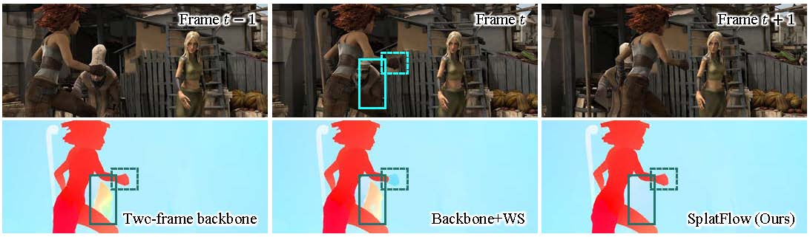

# SplatFlow: Learning Multi-frame Optical Flow via Splatting
This repository contains the source code for our paper:
- SplatFlow: Learning Multi-frame Optical Flow via Splatting (IJCV 2024) | [Paper](https://arxiv.org/pdf/2306.08887.pdf)
  
  - [x] We propose a novel MOFE framework SplatFlow designed explicitly for the single-resolution iterative two-frame backbones. 
  - [x] Compared with the original backbone, SplatFlow has significantly higher estimation accuracy, especially in occluded regions, while maintaining a high inference speed.
  - [x] At the time of submission, our SplatFlow achieved state-of-the-art results on both the [Sintel](http://sintel.is.tue.mpg.de/quant?metric_id=0&selected_pass=1) and [KITTI2015](https://www.cvlibs.net/datasets/kitti/eval_scene_flow.php?benchmark=flow) benchmarks, especially with surprisingly significant 19.4% error reductions compared to the previous best result submitted on the Sintel benchmark.

## Updates
- [April 24, 2024] 📣 The code of SplatFlow is now available!
- [January 02, 2024] 📣 The paper of SplatFlow is accepted by IJCV 2024!

## Environment

Our code has been successfully tested in the following environments:

* NVIDIA 3090 GPU
* CUDA 11.1
* Python 3.8
* PyTorch 1.8.2
```
conda create -n splatflow python=3.8
conda activate splatflow

pip install torch==1.8.2 torchvision==0.9.2 --extra-index-url https://download.pytorch.org/whl/lts/1.8/cu111
pip install einops==0.4.1
pip install cupy-cuda111
pip install pillow==9.5.0
pip install opencv-python==4.1.2.30
```

## Quick start
To make the model (with [weights](https://pan.baidu.com/s/1v3WiEzkAXPtchVxEDu-vRw&pwd=sm11) after K-finetune) infer on KITTI data, run
```Shell
bash script/demo.sh
```

## Datasets

To train / test SplatFlow, you will need to download the required datasets.

* [FlyingThings3D](https://lmb.informatik.uni-freiburg.de/resources/datasets/SceneFlowDatasets.en.html)
* [KITTI2015](http://www.cvlibs.net/datasets/kitti/eval_scene_flow.php?benchmark=flow)

You can create symbolic links to wherever the datasets are downloaded in the `data` folder.

```text
data/
│
├─ FlyingThings3D/
│  ├─ frames_cleanpass/
│  ├─ frames_finalpass/
│  └─ optical_flow/
│
├─ KITTI/
│  ├─ training/
│  └─ testing/
│
└─ demo/
   ├─ image/
   └─ pred/
```

## Training

* Train SplatFlow under the C+T training process.
  ```Shell
  bash script/train_things.sh
  ```
  
## Testing

* Test SplatFlow on Things.
  ```Shell
  bash script/test_things.sh
  ```
  
* Test SplatFlow on KITTI.
  ```Shell
  bash script/test_kitti.sh
  ```

## Acknowledgments
We would like to thank [RAFT](https://github.com/princeton-vl/RAFT), [GMA](https://github.com/zacjiang/GMA) and [SoftSplat](https://github.com/JHLew/SoftSplat-Full) for publicly releasing their code and data.

## Citing this Work

If you find our repository useful, please consider giving it a star ⭐ and citing our paper in your work:

```bibtex
@article{wang2024splatflow,
  title={SplatFlow: Learning Multi-frame Optical Flow via Splatting},
  author={Wang, Bo and Zhang, Yifan and Li, Jian and Yu, Yang and Sun, Zhenping and Liu, Li and Hu, Dewen},
  journal={International Journal of Computer Vision},
  pages={1--23},
  year={2024},
  publisher={Springer}
}
```
