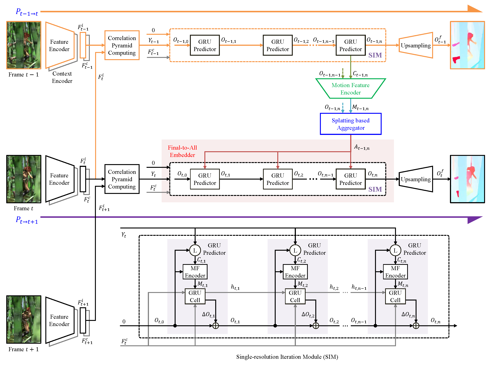

# SplatFlow: Learning Multi-frame Optical Flow via Splatting
This repository contains the source code for our paper:
- SplatFlow: Learning Multi-frame Optical Flow via Splatting (IJCV 2024) | [Paper](https://arxiv.org/pdf/2306.08887.pdf)
  

## Updates
- [April 24, 2024] 📣 The code of SplatFlow is now available!
- [January 02, 2024] 📣 The paper of SplatFlow is accepted by IJCV 2024!

## Environment
* NVIDIA 3090 GPU
* CUDA 11.1
* Python 3.8
* PyTorch 1.8.2

### Create a virtual environment and activate it.
```
conda create -n splatflow python=3.8
conda activate splatflow
```

### Dependencies
```
pip install torch==1.8.2 --extra-index-url https://download.pytorch.org/whl/lts/1.8/cu111
pip install einops==0.4.1
pip install cupy-cuda111
pip install pillow==9.5.0
pip install opencv-python==4.1.2.30
```

## Quick start
To make the model (with [weights](https://pan.baidu.com/s/1v3WiEzkAXPtchVxEDu-vRw&pwd=sm11) after K-finetune) infer on KITTI data, run
```Shell
python main.py
```

## Acknowledgments
We would like to thank [RAFT](https://github.com/princeton-vl/RAFT), [GMA](https://github.com/zacjiang/GMA) and [SoftSplat](https://github.com/JHLew/SoftSplat-Full) for publicly releasing their code and data.

## Citing this Work

If you find our repository useful, please consider giving it a star ⭐ and citing our paper in your work:

```bibtex
@article{wang2024splatflow,
  title={SplatFlow: Learning Multi-frame Optical Flow via Splatting},
  author={Wang, Bo and Zhang, Yifan and Li, Jian and Yu, Yang and Sun, Zhenping and Liu, Li and Hu, Dewen},
  journal={International Journal of Computer Vision},
  pages={1--23},
  year={2024},
  publisher={Springer}
}
```
